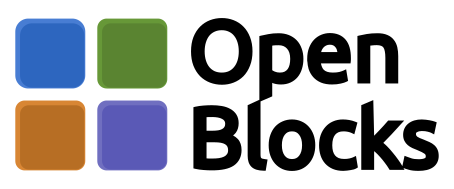
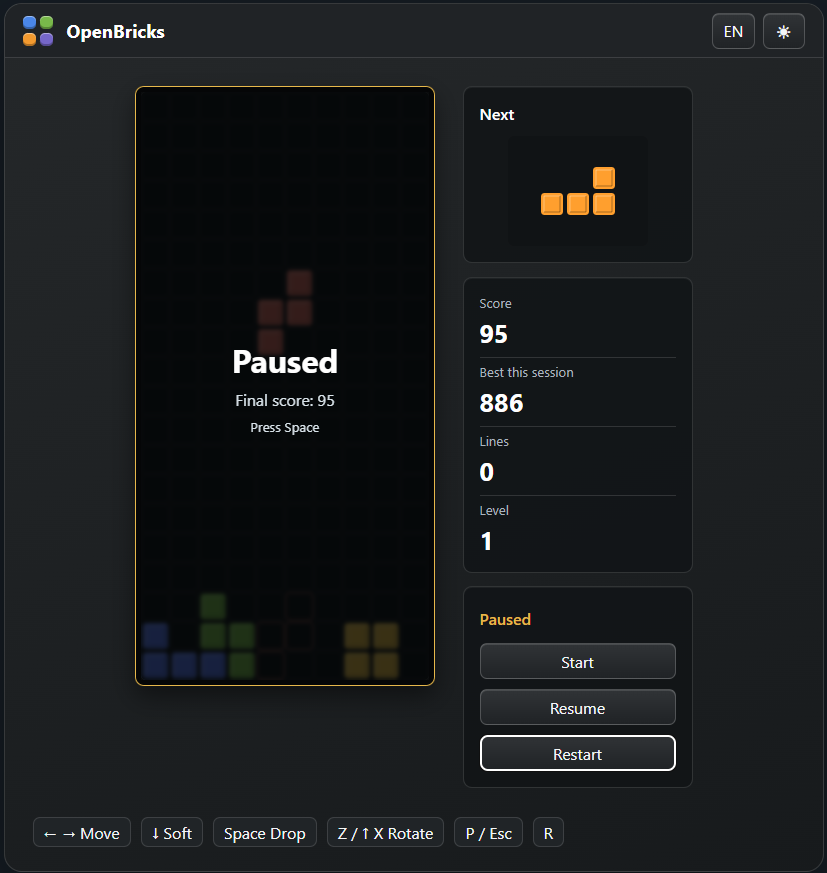

# OpenBlocks

<p align="center">
  
</p>

<p align="center">
  
  
  
  
  
  
  
  
</p>

OpenBlocks is a browser-based block-stacking puzzle game built with Angular. The game runs fully on the frontend, uses Canvas 2D for crisp rendering, and keeps gameplay logic separated from Angular so the core mechanics are easy to test and maintain.

The project is designed as a clean, open-source web game that can be played in any modern browser.

## Screenshots

<p align="center">
  
</p>

## Features

- Fast block-stacking gameplay on a compact vertical board
- A curated set of rotating block shapes
- Randomized piece generation with fair shape distribution
- Upcoming-piece preview
- Landing guide for the active piece
- Soft drop, hard drop, rotation, pause, restart, and keyboard-first controls
- Current score, level, cleared rows, and best score for the current browser session
- Automatic pause when the browser tab is hidden
- Light and dark themes
- Polish and English UI text
- Unit-tested game engine

## Controls

| Key              | Action                                     |
| ---------------- | ------------------------------------------ |
| `Space`          | Start/resume game or hard drop during play |
| `Left` / `Right` | Move piece                                 |
| `Down`           | Soft drop                                  |
| `Up` / `X`       | Rotate clockwise                           |
| `Z`              | Rotate counter-clockwise                   |
| `P` / `Escape`   | Pause                                      |
| `R`              | Restart                                    |

## Tech Stack

- Angular standalone components
- TypeScript
- Angular Signals
- Canvas 2D
- SCSS with semantic color variables
- Vitest through Angular's unit-test builder

## Architecture

The game is split into focused layers:

- `GameEngine` handles rules, board state, scoring, piece movement, collision detection, row clearing, levels, and game status.
- `BoardRenderer` draws the board and next-piece preview on Canvas 2D.
- `InputController` handles keyboard input and repeat behavior.
- Angular components provide the application shell, controls, theme/language toggles, status overlay, and score panels.

## Getting Started

Install dependencies:

```bash
pnpm install
```

Start the development server:

```bash
pnpm start
```

Open:

```text
http://localhost:4200/
```

## Build

Create a production build:

```bash
pnpm build
```

Build output is written to `dist/open-blocks`.

## Tests

Run unit tests:

```bash
pnpm test
```

The tests cover core gameplay behavior such as collision detection, rotations, row clearing, scoring, piece randomization, visible spawning, and game-over detection.

## License

This project is released under the [MIT License](/LICENSE).
